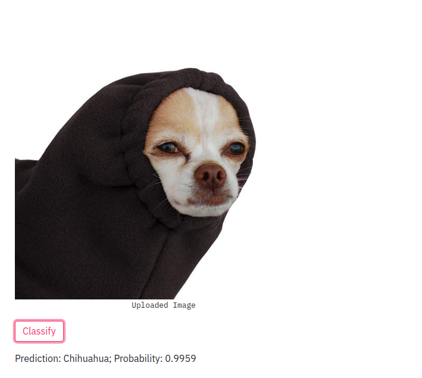
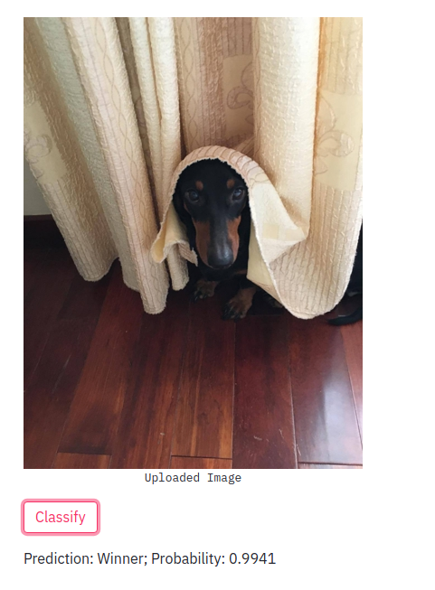
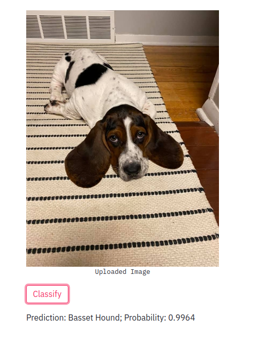
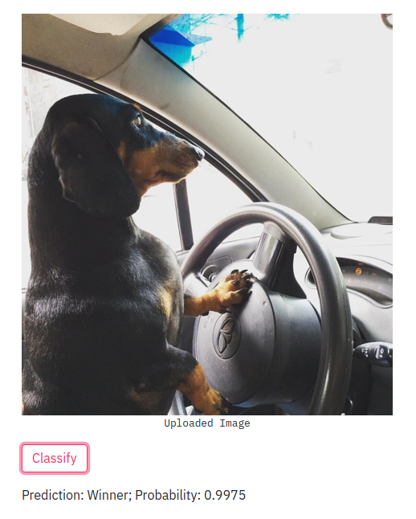

 
 
# Dog Classifier

This is a simple app to classify dogs with [fastai](https://docs.fast.ai/) and [streamlit](https://www.streamlit.io/). The app is deployed using Streamlit Sharing. Click [ here :) ](https://share.streamlit.io/khuyentran1401/dog_classifier/main/dog_classifier.py) to view and play with the app.  

## Overview
### Dataset
450 different dog images are obtained using [Bing Image Search API](https://www.microsoft.com/en-us/bing/apis/bing-image-search-api). There are 150 images of each type of dog. The non-relevant images are removed. 

### Model

I use a convolution neural network (CNN) with architecture ResNet to train the model. 

*cnn_learner* will also load a pre-trained model that have already was trained to recognize a thousand different categories across 1.3 million photos.

The model was trained to recognize 3 types of dog: Winner, Chihuahua, and Basset Hound using fastai. You can find the details of the training in [train_dog_classifier.ipnb](./train_dog_classifier.ipynb) notebook. The model was saved to [dog.pkl](./dog.pkl).

## How to use the app

Click Browse files to upload a dog image. Note that since the app is trained on just 3 kinds of dogs: Winner, Chihuahua, and Basset, make sure to upload only images of these dogs. 

## Results
I use photos of people I know dog's photos and other photos I found from the INternet to test the performance of the model.  The model can recognize dogs with high accuracy. Here are some results:

